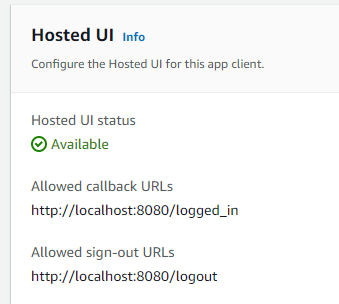

# aws_cognito_flask
Connecting Flask app to AWS cognito's user pool


## Requirements
Assuming we want to set emails to our users from a verified account and domain
- a domain we own and have access to its DNS records
- an email address

Optionally, we would need to opt in for Cognito to send messages in our behalf.
This option is for testing purposes and is limited to 50 emails per day. 


## Key configuration during pool creation
This step is necessary to exchange code for token.
- When creating the app client, thick `Generate a client secret`. 
- When selecting about `OpenID connect scopes`, be sure to thick the box `aws.cognito.signin.user.admin`.


## Hosted UI
The hosted UI link is located in
```
Amazon Cognito > 
User pools > 
{Your User Pool} > 
App integration > 
App client list > 
{Your app client} > 
Hosted UI > 
View Hosted UI
```
Copy the URL.

In the same location verify that the callback and signout urls correctly point to your routes.
